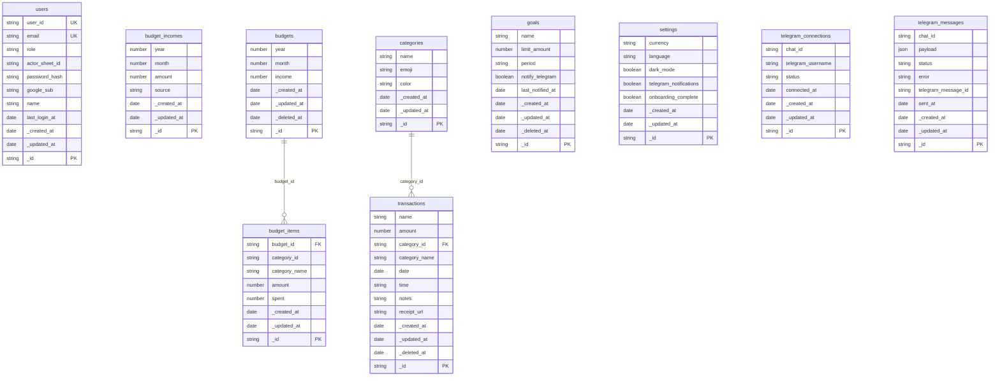

# ER Diagram

Auto-generated by `lsdb erdiagram` on 2026-07-23T07:22:37.048Z. Re-run after schema changes to refresh.

## Tables by actor

- **admin**: users
- **user**: budget_incomes, budget_items, budgets, categories, goals, settings, telegram_connections, telegram_messages, transactions

## Diagram

