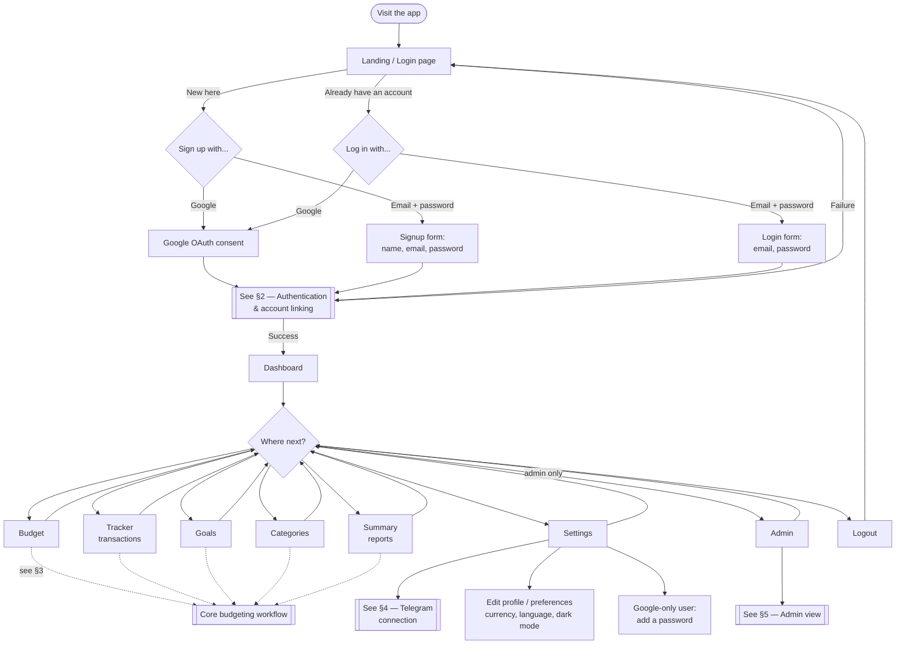
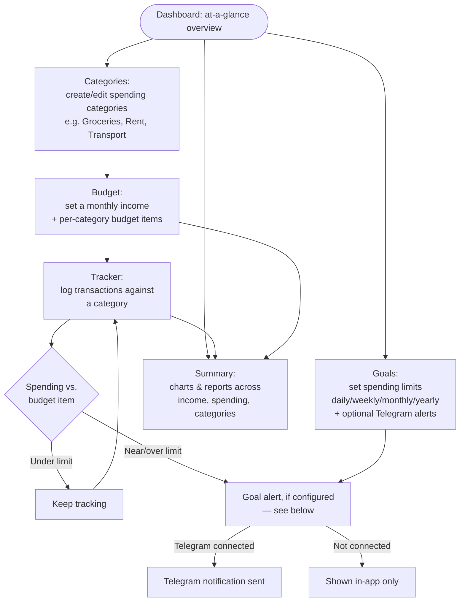
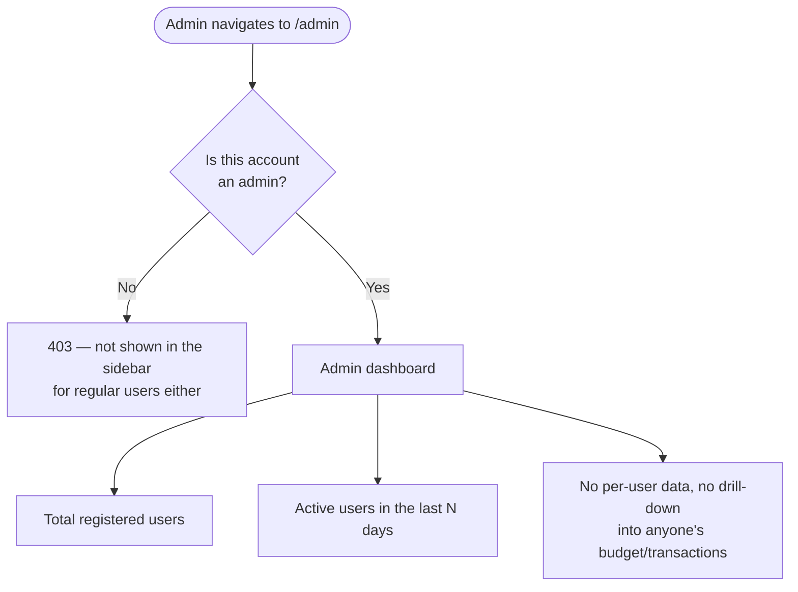

# User Flow — Budget Managing

A complete map of what a user (or admin) can do in the app, end to end:
getting in, the core budgeting loop, Telegram notifications, and the admin
view. Written against the target `apps/backend` design in
[`BACKEND_REBUILD_PLAN.md`](./BACKEND_REBUILD_PLAN.md) — both auth methods
(Google OAuth and email/password) and every feature in the sidebar
(`apps/frontend/components/layout/Sidebar.tsx`: Dashboard, Budget, Tracker,
Goals, Categories, Summary, Settings, and Admin for admin accounts).

## 1. Top-level journey

The whole app in one picture: how someone arrives, signs in, and moves
between features until they log out.



## 2. Authentication & account linking

The rebuild supports **two independent login methods that resolve to the
same account** when the email matches — this is the part most worth getting
right as a user (e.g. "I signed up with Google, can I also set a
password?"). See `docs/BACKEND_REBUILD_PLAN.md` §4.4/§6 for the backend
implementation this diagram mirrors.

```mermaid
flowchart TD
    A([User chooses a sign-in method]) --> B{Google or\nemail+password?}

    B -->|Google| C[Redirect to Google consent screen]
    C --> D[Google redirects back with\nan authorization code]
    D --> E[Backend exchanges code for tokens\nand verifies the Google identity]
    E --> F{Email already\nregistered?}

    F -->|No| G[Create account + provision\na personal Google Sheet\nin the user's own Drive]
    F -->|Yes, password-only account| H[Link Google to the\nexisting account\nsame sheet, same data]
    F -->|Yes, already linked| I[Normal login]

    G --> J[Issue app session token]
    H --> J
    I --> J
    J --> K[Redirect to Dashboard]

    B -->|Email + password| L{Registering or\nlogging in?}

    L -->|Register| M[Submit name, email, password]
    M --> N{Password strong enough?}
    N -->|No| M
    N -->|Yes| O{Email already\nregistered?}

    O -->|No| P[Create account + provision\na sheet in the app's Drive\nuntil Google is linked]
    O -->|Yes, has a password already| Q[409 — account exists,\nlog in instead]
    O -->|Yes, Google-only account| R[Link password to the\nexisting Google account]

    L -->|Log in| S[Submit email, password]
    S --> T{Credentials match?}
    T -->|No| U[Generic error —\n\"invalid email or password\"]
    T -->|Yes| V[Normal login]

    P --> J
    R --> J
    V --> J
    U --> S

    Q --> L
```

**Notes for the guide:**
- Identity is always the **email address**, never the login method — one
  account, one personal spreadsheet, no matter which way someone signs in.
- A session naturally expires after a while; the app silently refreshes it
  in the background using a refresh token, so most users never see this.
- Wrong email/password always shows the same generic error — the app never
  reveals which part was incorrect.

## 3. Core budgeting workflow

The actual day-to-day loop the app exists for.



## 4. Telegram connection & notifications

Connecting Telegram is a deep-link handshake, not a form — worth walking
through explicitly since it happens outside the app's own UI.

```mermaid
flowchart TD
    A([Settings page]) --> B[Tap \"Connect Telegram\"]
    B --> C[Opens t.me/&lt;bot&gt;?start=connect_&lt;email&gt;\nin the Telegram app]
    C --> D[User taps Start in Telegram]
    D --> E[Telegram calls the app's webhook\nwith the encoded email]
    E --> F[Backend decodes the email,\nlinks this chat to the account]
    F --> G[Settings page shows\n\"Connected\" + Telegram username]

    G --> H{What happens next}
    H --> I[Goal/budget alerts arrive\nas Telegram messages]
    H --> J[Manually send a test message\nfrom the app]
    H --> K[Disconnect from Settings]

    K --> A
```

## 5. Admin view

Read-only, aggregate-only — an admin account never sees another user's
budget data (see `docs/BACKEND_REBUILD_PLAN.md` §4.7 for why).


